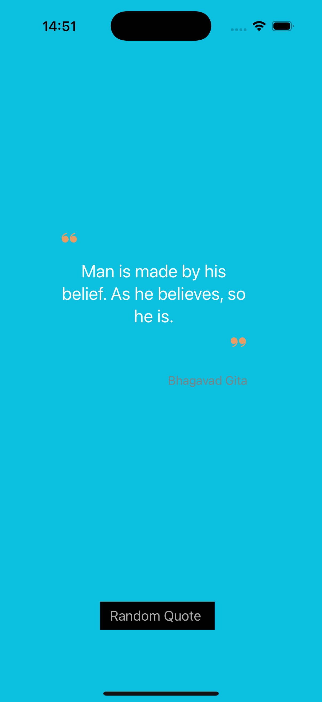
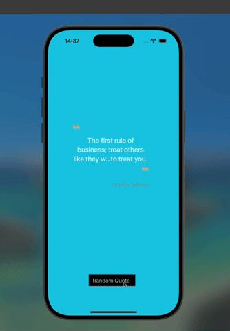

# 🌿 Sage

Une application iOS minimaliste en **UIKit** qui affiche des citations inspirantes.
    
---   
    
## Home screen

<p align="center">

</p>


---

## Demo Video

<div align="center">

</div>

---

## ✨ Fonctionnalités
- Affiche des citations inspirantes aléatoires
- Interface simple et épurée
- Mode clair & sombre pris en charge
- Rafraîchissement des citations en un clic

---

## 🛠️ Technologies
- Swift 5
- UIKit
- Xcode 15+

---

## 🚀 Installation
1. Clone le dépôt :
   ```bash
   git clone https://github.com/KMIOS91/Sage
